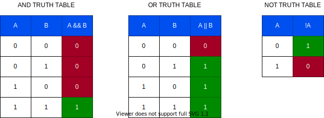

# JavaScript Session-2 Class Notes :rocket:

## Session-2 Variables

- Variables -
- The Assignment Operator
- Naming Rules
- Reserved Words in JS
- Let and Const


### What is a Variable?

- In computer programming, a variable , either known or unknown, a container for storing data with a given name.
  
- JS Variable Types
  - Var
  - Const
  - Let
  
- Hoisting : a variable can appear to be used before it's declared.

  ```js
  a = 3;
  console.log(a);
  var a;
  ```

---

## Session-2 Data types, Operators

- What is type in terms of programming?

- Dynamic Typing vs static typing

  JavaScript is a *dynamically typed* language. This means you *don't have to specify the data type* of a variable when you declare it. You can assign different type of data on a variable, (you can change not only the value of a variable but the type of its content as well) It also means that data types are *automatically converted* as-needed during script execution.

  ## Data Types

- What are the differences between primitives and the objects?

  - primitives are immutable (does not change), therefore transferred by value literal
  - primitives hold single type of value and only one data
  - primitives does not have properties *later we will discuss this on strings*
  - objects are mutable, variable holds reference to object
  - object types can hold more than one primitive and/or objects with different types as well
  - objects are sets of properties and methods
  - except for null and undefined all primitive types has object equivalences. 

- Seven data types that are primitives :

  1. [Boolean](https://developer.mozilla.org/en-US/docs/Glossary/Boolean). `true` and `false`.

     js has some truthy and falsy values as mentioned in the previous session. :thumbsup:

     ```js
     false == false; // true
     
     Boolean(0); // false
     Boolean("0") === true; // yes 👍
     0 == false; // true
     
     Boolean(null); // the value is false
     null == false // false
     null == true; // false
     typeof null; // "object"
     0 == null; // false
     
     Boolean(undefined); // the value is false
     undefined == false; // false
     undefined == true; // false
     0 == undefined; // false
     
     null == undefined; // true
     null === undefined; // false
     
     Boolean("") // empty string -> value is false
     "" == false; // true
     Boolean({}) // empty object -> true
     
     ```

     

  2. [null](https://developer.mozilla.org/en-US/docs/Glossary/Null). A special keyword denoting a null value. (Because JavaScript is case-sensitive, `null` is not the same as `Null`, `NULL`, or any other variant.)

     `null` is used to indicate intentional absence of an object value, null is a primitive type.

     ```js
     null == undefined; // true
     null === undefined; // false
     ```

     **Note:** The `typeof null` is `object`

     ```js
     typeof null; // "object"
     typeof undefined; // "undefined"
     typeof false; // "boolean"
     typeof 0; // "number"
     typeof NaN; // "number"
     ```

      

  3. [undefined](https://developer.mozilla.org/en-US/docs/Glossary/undefined) means that a variable is declared but no value is assigned. On the other hand, "is not defined" means the variable is not declared

     > The standard clearly defines that you will receive `undefined` when accessing uninitialized variables, non-existing object properties, non-existing array elements an alike
     >
     > *source: https://dmitripavlutin.com/7-tips-to-handle-undefined-in-javascript/*

     - undefined represents the absence of an assigned value. 

       `typeof undefined === 'undefined' ` one of the best ways to check

     - null is an object that indicates that a variable has been explicitly assigned "no value". 

       `typeof null === 'object'` 

       as an example, thermometer shows 0 degree C, this is a valid value, but if it returns `null`, this means cannot measure the temperature; if there is no thermometer then the result will be `undefined`

     - It is a property of global object `window` or `global` in NodeJS and `globalThis` for all

     ```js
     // Only in browsers 
     console.log(window.undefined); // undefined
     window.hasOwnProperty('undefined'); // true 
     ```

     - `var` declaration problem is [the variable hoisting](https://dmitripavlutin.com/javascript-hoisting-in-details/#hoisting-and-var) within the function scope. You can declare a `var` variable somewhere at the end of the function scope, but still, you can access it before declaration: and you’ll get an `undefined`.

       **HOW TO HANDLE PROPERLY**

       [nullish coalescing](https://developer.mozilla.org/en-US/docs/Web/JavaScript/Reference/Operators/Nullish_coalescing_operator)

  4. [Number](https://developer.mozilla.org/en-US/docs/Glossary/Number). An integer or *floating point number*. For example: `42` or `3.14159`.

     some useful constants:

     `NaN`: not a number as the name suggests given value is not a valid number

     ```js
     NaN == NaN; // false
     NaN === NaN; // false
     typeof NaN; // "number"
     ```

     when comparing a value whether it is a number or not, use global function`isNaN()`

     ```js
     Number.MAX_VALUE; // 1.7976931348623157e+308
     Number.MAX_SAFE_INTEGER; // 9007199254740991
     Number.MIN_VALUE; // 5e-324
     Number.MIN_SAFE_INTEGER; // -9007199254740991
     Number.EPSILON; // 0.0000000000000002220446049250313
     Number.POSITIVE_INFINITY; // Infinity
     Number.NEGATIVE_INFINITY; // -Infinity
     Number.NaN; // NaN
     ```

     some functions

     ```js
     Math.floor()
     Math.ceil()
     Math.trunc();
     Math.round();
     //try with both positive and negative values
     Math.random();
     ```

     **some values:**

     ```js
     123 == 123.0; // true
     Number('123')     // 123
     Number('123') === 123 /// true
     Number('12.3')    // 12.3
     Number('12.00')   // 12
     Number('123e-1')  // 12.3
     Number('')        // 0
     Number(null)      // 0
     Number('0x11')    // 17
     Number('0b101')   // 5
     Number('0o11')    // 9
     Number('025')    // 21 !!
     015 + 025 // 34
     15 + 025 // 36
     015 + 25 // 38
     15 + 25 // 40
     ```

     

  5. [BigInt](https://developer.mozilla.org/en-US/docs/Glossary/BigInt). An integer with arbitrary precision. For example: `9007199254740992n`.

     extended integer number type, it does not support all operations. mixed usage may cause data loss.

  6. [String](https://developer.mozilla.org/en-US/docs/Glossary/String). A sequence of characters that represent a text value. For example: "Howdy"

     *We will cover it later in detail.* 

  7. [Symbol](https://developer.mozilla.org/en-US/docs/Glossary/Symbol) (new in ECMAScript 2015). A data type whose instances are unique and immutable.

     *we will cover at objects lesson roughly.*

- and [Object](https://developer.mozilla.org/en-US/docs/Glossary/Object)  *(arrays and functions are object in JavaScript)*

## Operators

JavaScript has the following types of operators. This section describes the operators and contains information about operator precedence.

- [Arithmetic operators](https://developer.mozilla.org/en-US/docs/Web/JavaScript/Guide/Expressions_and_Operators#arithmetic_operators)

  - In addition to (`+`, `-`, `*`, `/`), remainder: `%`, unary plus`++`, unary minus `--`, unary negation `-`, unary plus `+`,  exponentiation`**`

- [Assignment operators](https://developer.mozilla.org/en-US/docs/Web/JavaScript/Guide/Expressions_and_Operators#assignment_operators)

- [Logical operators](https://developer.mozilla.org/en-US/docs/Web/JavaScript/Guide/Expressions_and_Operators#logical_operators)

  and or not *no xor* in high level

  

- [Bitwise operators](https://developer.mozilla.org/en-US/docs/Web/JavaScript/Guide/Expressions_and_Operators#bitwise_operators)

  - To do some bit level logic operations at 32bits (zeros and ones)
  - logical plus xor, shift left, shift right , zero fill shift right

- [Comparison operators](https://developer.mozilla.org/en-US/docs/Web/JavaScript/Guide/Expressions_and_Operators#comparison_operators)

  equal and strict equal, greater than, greater than or equal to, less than,  less than or equal to, not equal, strict not equal

- [String operators](https://developer.mozilla.org/en-US/docs/Web/JavaScript/Guide/Expressions_and_Operators#string_operators)

  in addition to comparison  addition operator

- [Conditional (ternary) operator](https://developer.mozilla.org/en-US/docs/Web/JavaScript/Guide/Expressions_and_Operators#conditional_ternary_operator) *We will cover later*

- [Comma operator](https://developer.mozilla.org/en-US/docs/Web/JavaScript/Guide/Expressions_and_Operators#comma_operator)

- [Unary operators](https://developer.mozilla.org/en-US/docs/Web/JavaScript/Guide/Expressions_and_Operators#unary_operators)

  typeof, delete (from object), in, instance of

- [Relational operators](https://developer.mozilla.org/en-US/docs/Web/JavaScript/Guide/Expressions_and_Operators#relational_operators)

  in, instanceof

> *source:https://developer.mozilla.org/en-US/docs/Web/JavaScript/Guide/Expressions_and_Operators*

Js has unary, binary and one ternary operator.

- **binary operators** requires two operands

  *operand* **operator** *operand*

- **unary operator**

  **operator** *operand* 	or	*operand* **operator**

### Operator Precedence

[operator precedence table](https://developer.mozilla.org/en-US/docs/Web/JavaScript/Reference/Operators/Operator_Precedence#table)
